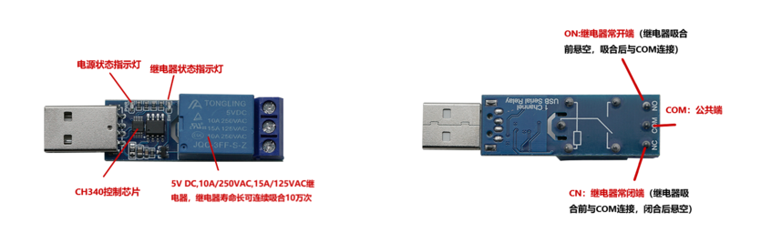

# usb-controlled-relay
for LCUS-1 5V USB Relay Module CH340 USB Control Switch **in LINUX**

Baud Rate: 9600bps

## HowTo

	Usage: ./deaf_alarm.sh <0|1>
		   0: Turn the Relay Off(keep NO and COM disconnected)
		   1: Turn the Relay On(connect NO and COM)
		   without param: Turn the relay on, sleep 1 second, and turn the relay off

	Usage: ./opendoor.sh
